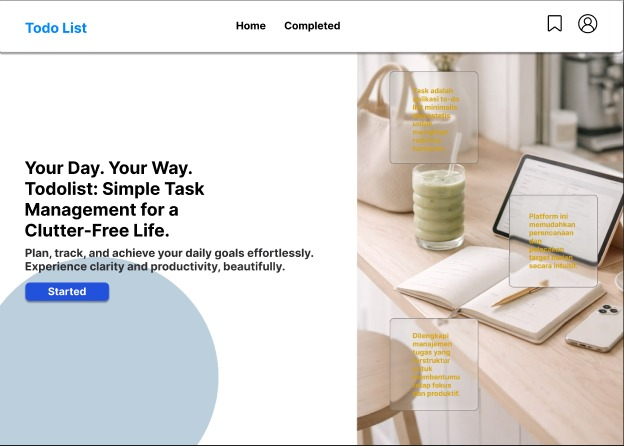
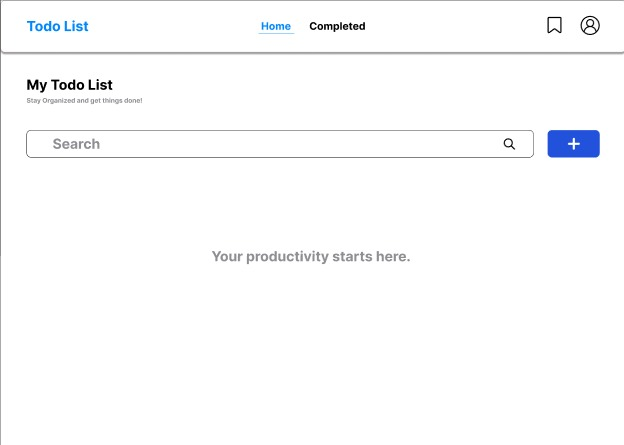
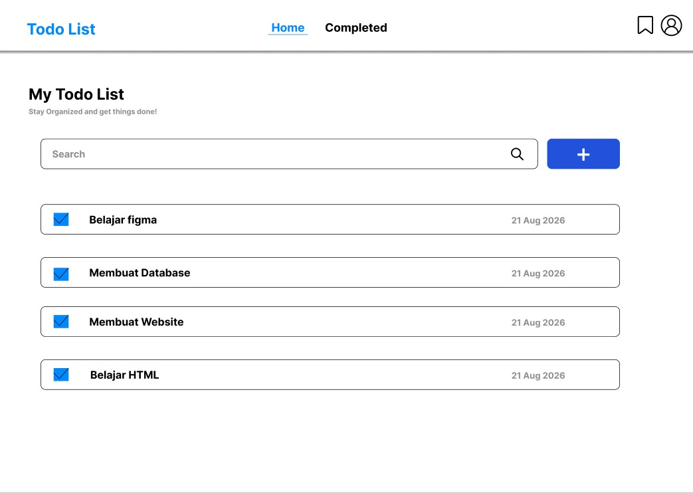
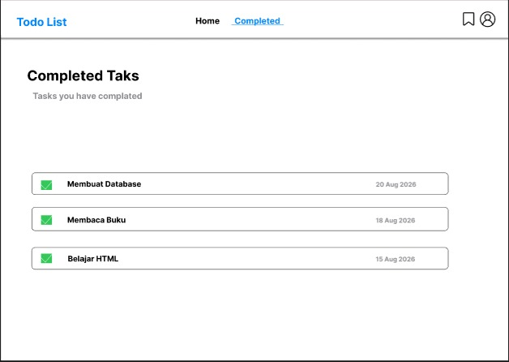
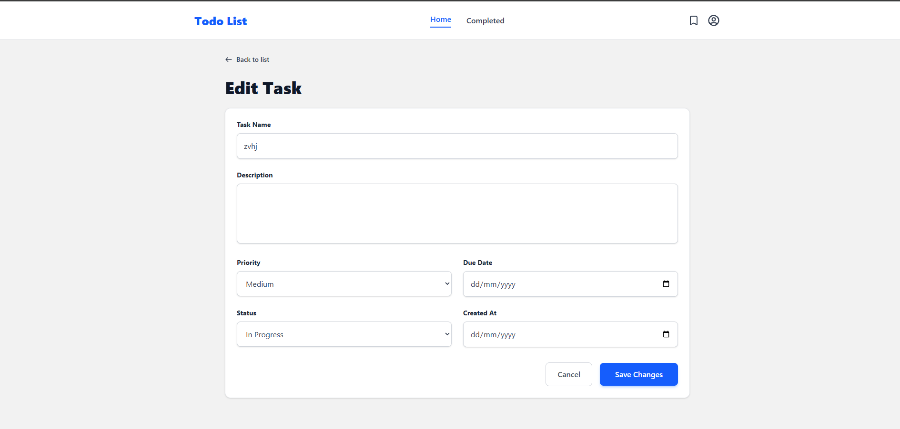
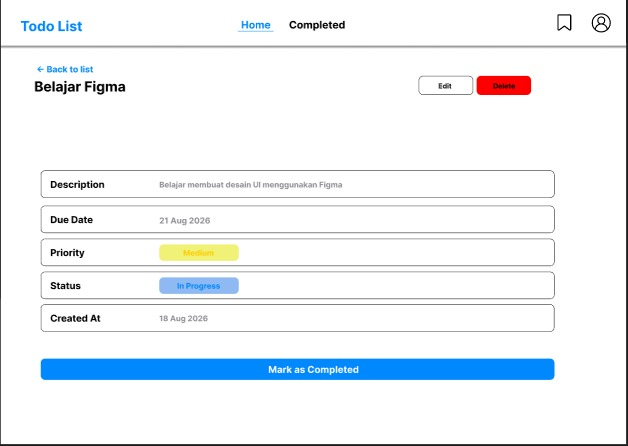
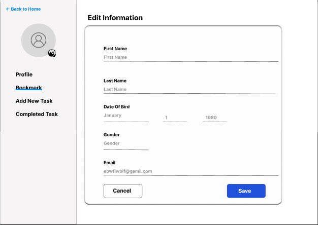
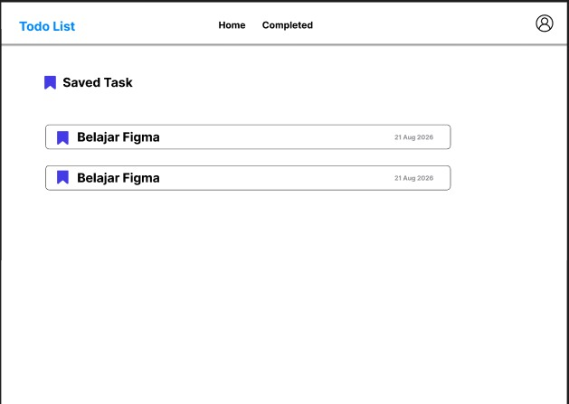
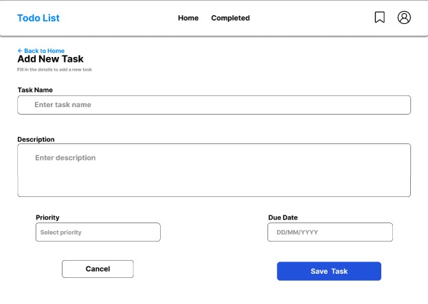

#Rais (Pm)
#Heni (Back End)
#Idan (UI/UX Resigner)
#Maura (Front End)
#Rifqi (QA/Tester)

## UI/UX

Aplikasi Todo List dirancang dengan konsep clean, simple, dan
user-friendly. Tampilan dibuat agar pengguna dapat mengelola tugas
dengan mudah dan tidak terlalu banyak berpindah halaman.

**Halaman yang tersedia:**
- Landing Page untuk halaman awal aplikasi.
- Home Page untuk melihat dan mencari daftar tugas.
- Add To Do untuk membuat tugas baru.
- Task Detail untuk melihat dan mengelola detail tugas.
- Completed Task untuk melihat tugas yang telah selesai.
- Saved Task untuk menyimpan tugas melalui Bookmark.
- Profile untuk melihat dan mengubah informasi pengguna.

**User Flow:**

Landing Page → Home → Add To Do → Save Task → Task Detail
→ Mark as Completed → Completed Task

Bookmark dan Profile dapat diakses melalui navigasi pada Home Page.

